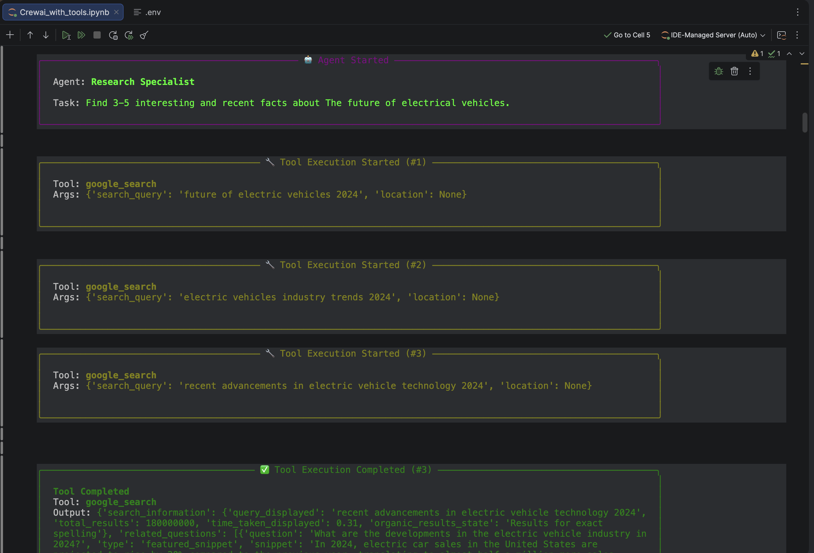
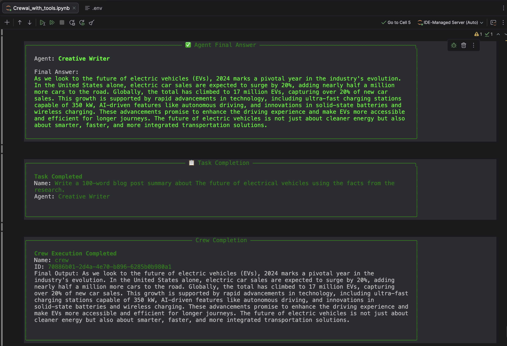
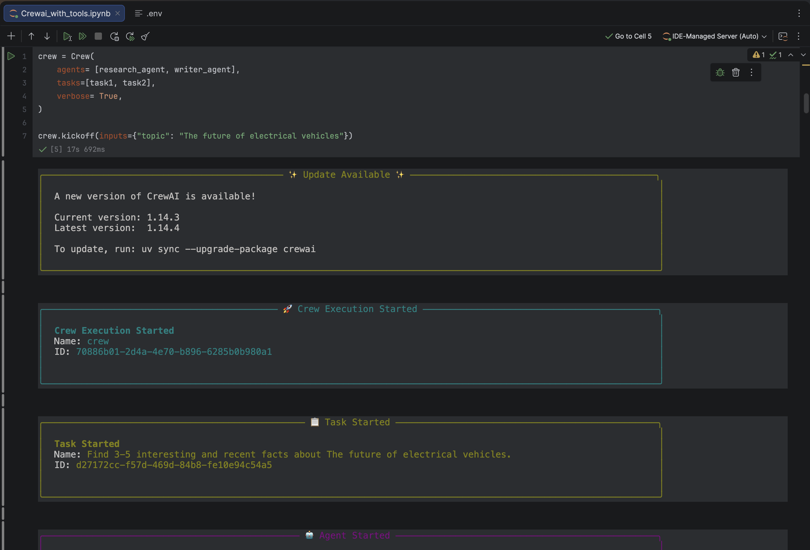

# CrewAI Multi-Agent System with Tools

## Overview
This project demonstrates a multi-agent AI workflow built using CrewAI and external tools. The system coordinates multiple AI agents to perform automated research, task execution, and intelligent response generation.

## Problem Statement
The objective of this project is to design an AI-powered multi-agent system that can collaborate dynamically to solve tasks efficiently using Large Language Models (LLMs) and external tools.

## Technologies Used
- Python
- CrewAI
- OpenAI / LLM APIs
- Prompt Engineering
- AI Agents
- Jupyter Notebook

## Features
- Multi-agent collaboration
- Tool integration
- Automated research workflows
- Task delegation and execution
- AI-generated responses
- Agent-based orchestration

## AI Concepts Used
- Agentic AI
- Multi-Agent Systems
- Prompt Engineering
- Large Language Models (LLMs)
- Workflow Automation
- Tool Calling

## Results
The project successfully demonstrates how multiple AI agents can coordinate together to complete tasks efficiently using external tools and intelligent workflows.

## Output Screenshots

### Multi-Agent Workflow


### Agent Output


### Task Execution


## How to Run

1. Clone the repository
2. Install dependencies
3. Add API keys securely
4. Open notebook and run all cells

## requirements.txt
Install dependencies using:
```bash
pip install -r requirements.txt
```

## Future Improvements
- Add memory support
- Integrate vector databases
- Add web UI using Streamlit
- Build autonomous AI workflows
- Integrate RAG pipelines

## Author
Rutvi Patel
